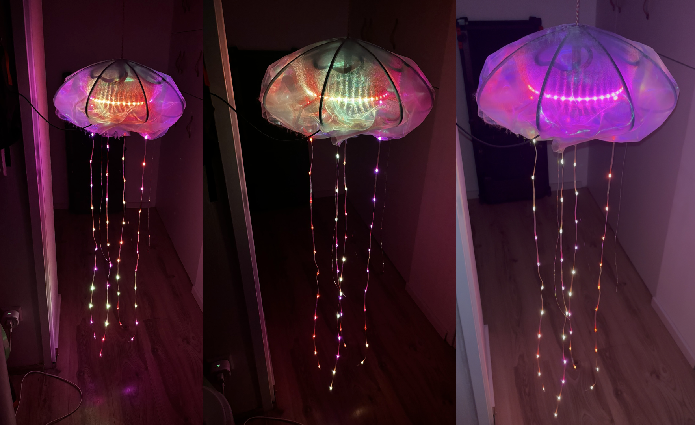

# JellyFloatOS

[](https://github.com/MacBachi/Jellyfish/actions/workflows/build-firmware.yml)
[](https://github.com/MacBachi/Jellyfish/releases/latest)
[](LICENSE.md)

Firmware for a bloom of audio-reactive, WLAN-synchronised LED jellyfish on the Raspberry Pi Pico 2 W.



> **Origin and credit.** JellyFloatOS started as a fork of the Sheffield-by-the-Sea EMF2026 Jellyfish,
> **https://github.com/Sheffield-by-the-sea/Jellyfish**, and is continued here as its own project. The idea,
> the design, the 3D models, the circuit board and the original firmware are the work of Alex
> ([Mastodon](https://mastodon.social/@GlitchEngine), [GitHub](https://github.com/AlexJMcIntyre)) and the
> Sheffield-by-the-Sea crew, built for [Electromagnetic Field](https://www.emfcamp.org); the original write-up
> is on [Pimoroni Learn](https://learn.pimoroni.com/article/building-sound-reactive-jellyfish). Nothing here is
> reviewed, endorsed or supported by them. If you want to build the original, start from their repository.

## What it does

- **Sound-reactive and calm modes.** The original noise-field and beat-driven drop modes, plus ten slow, dim
  modes (Breathe, Glimmer, Aurora, Current, Lantern, Moonlight, Drizzle, Fireflies, Swarm, Whisper) and a
  playlist that wanders through them. Every mode change crossfades over one second.
- **A bloom, not a single jelly.** Jellies find each other over WLAN: one becomes the access point, the rest
  join. Display mode, brightness, hue, the animation clock and beats stay in step, and a button press on any
  jelly switches all of them.
- **Per-jelly colours.** The access point hands out colour slots, so palette modes give every jelly its own
  colour and the Swarm mode walks a pulse from one to the next.
- **Remote control without an app.** A web page served by the jelly itself, or plain text lines over UDP
  from any device on the jelly network, e.g. with `nc`.
- **One firmware for every build.** All seven tentacle headers on the board are driven; headers without a
  strip simply send into nothing.

## Hardware

Everything to build one is in this repository: [3D print files](3D%20print%20files/), the KiCad project and
production files for the control board in [pcb/](pcb/), and the [bill of materials](BOM.md).

| | |
|---|---|
| Controller | Raspberry Pi Pico 2 W (RP2350, CYW43 WLAN) |
| Ring | 96 × WS2812B, 144 LEDs/m strip |
| Tentacles | up to 7 strings of up to 16 WS2812B "fairy wire" LEDs; the original build uses 4 × 12 |
| Loops | 4 × 300 mm LED noodles, PWM-driven |
| Microphone | INMP441, I2S |
| Buttons | 2 × tactile, previous / next mode |

### Pin map

| GPIO | Function | Board header |
|---|---|---|
| 2 | ring data | NeoPix1 |
| 3–9 | tentacle data 1–7 | NeoPix2–8 |
| 12–15 | noodles 1–4 (PWM, via series resistor) | LED1–4 |
| 16 / 17 / 18 | microphone BCLK / WS / DIN | M1 |
| 19 / 20 | button previous / next (active low, internal pull-up) | B1 / B2 |
| 10 / 11 | spare | I2C |
| 23, 24, 25, 29 | WLAN chip, internal to the Pico | |

### Power

WS2812B LEDs draw up to 60 mA each at full white: the ring alone can reach 5.8 A, four tentacles 2.9 A.
The calm modes run at 2–15 % brightness with saturated colours and stay far below that, so a 2.4 A USB
supply into the Pico's micro-USB is fine for them. For bright modes or more than four tentacles, feed 5 V
to the strips directly from the supply and let the board carry data and ground only: the board's 5 V traces
are 0.4 mm wide and the Pico's USB path is good for about 1 A. A 1000 µF capacitor at the ring's 5 V input
and short data leads (the Pico drives 3.3 V into 5 V LEDs, which usually works but dislikes long wires)
save a lot of debugging. `BRIGHTNESS_MODIFIER` in `jell_config.hpp` caps the overall brightness at build time.

## Getting started

### Flash a release

Download `JellyFloatOS.uf2` from the [latest release](https://github.com/MacBachi/Jellyfish/releases/latest).
Hold BOOTSEL on the Pico, plug in USB, copy the file onto the `RP2350` drive that appears. The jelly starts
in the sound-reactive field mode and begins looking for a network.

### Build it yourself

You need CMake, Ninja, the ARM GNU toolchain and the Pico SDK 2.x **with submodules** (they hold the WLAN
driver and lwIP):

```bash
brew install cmake ninja && brew install --cask gcc-arm-embedded
git clone -b 2.2.0 --recurse-submodules https://github.com/raspberrypi/pico-sdk ~/pico-sdk
```

Then, from the repository root:

```bash
cp .github/pico_sdk_import.cmake firmware_cpp/
PICO_SDK_PATH=~/pico-sdk cmake -S firmware_cpp -B firmware_cpp/build -G Ninja -DPICO_BOARD=pico2_w -DCMAKE_BUILD_TYPE=Release
cmake --build firmware_cpp/build
```

The firmware is `firmware_cpp/build/JellyFloatOS.uf2`. The CI does the same on every push and attaches the
result as an artifact; a pushed tag such as `v0.9.0` publishes it as a release, with the
default firmware and the 39-LED GRB/RGB variant attached. `python3 firmware_cpp/tools/elf_size.py
firmware_cpp/build/JellyFloatOS.elf` prints how much flash and RAM a build takes; the CI puts the same
numbers in its job summary.

### Versions

The `VERSION` file at the repository root is the one version number for firmware and app: CMake compiles
it into the firmware, and the app's build stamps it into its Info.plist. Between releases it reads like
`0.9.1-dev`; a release sets it to the plain number and pushes the matching tag (the release job refuses a
tag that does not match). Every jelly announces its version and its number of modes in its `HELLO`, prints
them on the serial console at boot, and the app shows what each jelly runs, what the newest version is and
where they differ.

Mixed versions keep working. Nothing is refused: a jelly told a mode number it does not know wraps around
to a lower one (mode 19 on a 19-mode jelly shows mode 0), and the app says so on the tile and in the
Jellies tab instead of hiding the mode.

Ring size, colour order of the strips, network name and password can be set per build without editing
the sources:

```bash
cmake ... -DJELL_RING_LEDS=39 -DJELL_RING_ORDER=RBG -DJELL_TENTACLE_ORDER=GRB -DJELL_WIFI_SSID=bloom -DJELL_WIFI_PASSWORD=secret123
```

Find the colour order with the LED channel test mode: it must show red, then green, then blue.

The same three options are inputs of the CI workflow's manual run ("Run workflow" in the Actions tab), which
attaches the variant as an artifact, e.g. `JellyFloatOS-ring39`. The ring size matters: it sets the angular
spacing of the ring's pixels, so a 39-LED ring built with the default 96 would show position-based effects
squeezed into part of the circle.

## The bloom: WLAN between jellies

Every jelly runs the same firmware. On power-up it listens for the jelly network for a random 10 to 120
seconds. If it hears one it joins as a station; if not, it listens through one more scan and then becomes
the access point itself. So: switch the first jelly on, wait for its onboard LED to go solid, then switch
on the rest. If the AP jelly disappears, the others keep their last state and start a new election.

- Network name is the jellyfish emoji 🪼, password `FroschUndMaus`. Both can be changed at build time, see above.
- Joining the network is the only access control. Anyone on it can control the bloom.
- Onboard LED: fast blink = looking for a network, solid = access point, slow blink = station.
- Jellies with different firmware versions can share a bloom; modes travel as bare numbers, so a mode a
  jelly does not have wraps to a lower one there. Each jelly announces its version, see "Versions" above.

### Commands

Control is one plain-text line per UDP datagram on port 4210. From a laptop on the jelly network:

```
nc -u 192.168.4.1 4210          # then type commands, one per line
nc -lu 4210                     # in a second terminal: watch heartbeats, beats and replies
```

| Command | Effect |
|---|---|
| `MODE n`, `NEXT`, `PREV` | switch the display mode on every jelly |
| `BRIGHT 0..1` | overall brightness |
| `HUE deg` | shift every colour by this many degrees |
| `CYCLE s` | period of the palette cycle mode |
| `IDENT` | the AP jelly blinks red three times, all others blue |
| `HELLO` | roll call: every jelly answers `HELLO <id> <AP\|STA> <slot> <ip> <version> <modes>` |
| `BEAT` | trigger a beat on all jellies (for testing the drops mode) |
| `HELLO <id> APP <slot> <ip> [<version> <modes>]` | register as an app: get a colour slot and unicast copies of everything the AP sends (STATE, BEAT, IDENT, SLOT) plus a `LEVEL 0..1` microphone stream, for 15 s per HELLO. The AP answers with its own `HELLO` and one for every jelly it has heard from lately, and passes later jelly `HELLO`s on, so the app has the whole roster. Phones need this because iOS does not let apps receive broadcasts. |

The USB serial console prints the election, role changes, every command sent or received, and the time
offset a station keeps to the AP's clock.

### Modes

In button order; the number is what `MODE n` takes.

| n | Mode | What it does |
|---|---|---|
| 0 | Breathe | a 6 s pulse from the ring down the tentacles |
| 1 | Glimmer | near dark, sparse cyan/green sparks |
| 2 | Aurora | slow bands of green, teal and violet |
| 3 | Current | a gentle wave travelling up the tentacles |
| 4 | Lantern | warm amber with a hint of candle flicker |
| 5 | Moonlight | very dim, cool blue-white night light |
| 6 | Drizzle | single slow drops with trails |
| 7 | Fireflies | single LEDs glowing up and down in yellow-green |
| 8 | Swarm | a pulse that visits one jelly after the other, in each jelly's palette colour |
| 9 | Whisper | slow microphone response, cool when quiet, warm when lively |
| 10 | Playlist | cycles through the calm modes every 3 minutes, all jellies together |
| 11 | Mic field (default) | the original sound-reactive noise field |
| 12 | Drops | beat-triggered drops down the tentacles |
| 13 | Palette | one colour per jelly |
| 14 | Palette cycle | same, rotating one colour further every `CYCLE` seconds |
| 15 | Ambient rainbow | |
| 16 | Ambient deep sea | |
| 17 | Mic level check | prints levels to the serial console |
| 18 | LED channel test | red, green, blue, and one noodle at a time |
| 19 | SOS | the whole jelly flashes SOS in red Morse code, all jellies in step |

## The web page

Every jelly serves a control page on port 80; the one that runs the network is at
**http://192.168.4.1** once your phone or laptop has joined the 🪼 network. The page shows the jelly
itself: the colours on its ring, tentacles and noodles as they are right now, drawn as a jellyfish, and
under it the mode tiles, brightness, colour shift and cycle, Identify and roll call, the roster with
every jelly's firmware version, and which modes a jelly with older firmware lacks. Nothing needs to be
installed, and the page never changes anything persistent: it only sends the runtime commands above.

How it works (`firmware_cpp/jell_web.cpp`, `firmware_cpp/web/`): lwIP's httpd serves `index.html` from
flash, `GET /api/state.json` returns this jelly and its roster, `GET /api/frame.bin` the current LED
colours (R, G, B per ring LED, then per tentacle LED, then one byte per noodle), and `POST /api/cmd`
takes one command line, handled exactly like a line from the network. The page polls the frame about
twelve times a second and the state once a second over a kept-alive connection. Everything under
`firmware_cpp/web/` is compiled into the firmware at build time, so a page change is a firmware build.

## Repository layout

| Path | Content |
|---|---|
| `firmware_cpp/` | the firmware: `JellyFloatOS.cpp` (main, both cores), `jell_net` (WLAN, election, protocol), `jell_web` + `web/` (the web page), `jell_effects` (modes), `jell_canvas` / `jell_led` (frame buffer, WS2812 output, crossfade), `jell_audio` (I2S microphone), `jell_state` (core-to-core state), `jell_config.hpp` (everything tunable), `tools/elf_size.py` (flash and RAM report) |
| `pcb/` | KiCad project and JLCPCB production files for the Jellyboard |
| `3D print files/` | base, ribs, pillar, loops, fabric plug |
| `ios/` | the earlier JellyFloat iPhone app (SwiftUI); superseded by the web page, kept for reference |
| `VERSION` | the one version number for firmware and app |
| `.github/workflows/` | CI: build on every push, release on `v*` tags |

## Roadmap

- Hardware test of the WLAN sync and the calm modes on a real bloom, tuning of beat thresholds and brightness floors.
- A software current limit for USB-powered builds.
- More tentacles per jelly and re-election details for larger blooms.

## License

MIT, see [LICENSE.md](LICENSE.md). The original project is MIT as well; its copyright notice is kept.

## Acknowledgments

- Alex and the Sheffield-by-the-Sea crew for the jellyfish, the board and the original firmware.
- [Pimoroni](https://shop.pimoroni.com) for parts and the write-up.
- The Raspberry Pi Pico SDK team; `firmware_cpp/dhcpserver.c` is from pico-examples (BSD-3).
